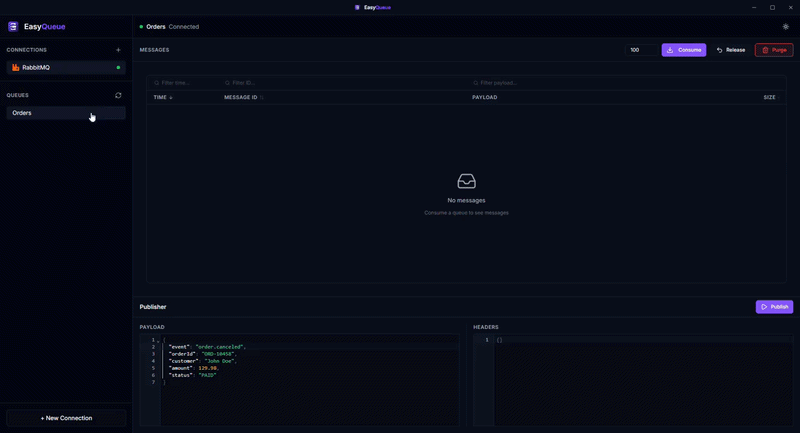
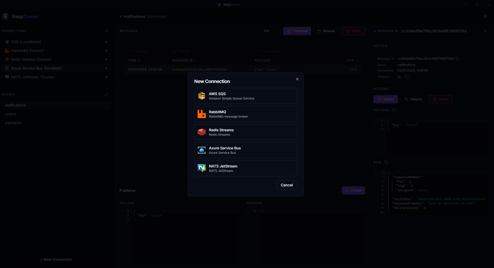
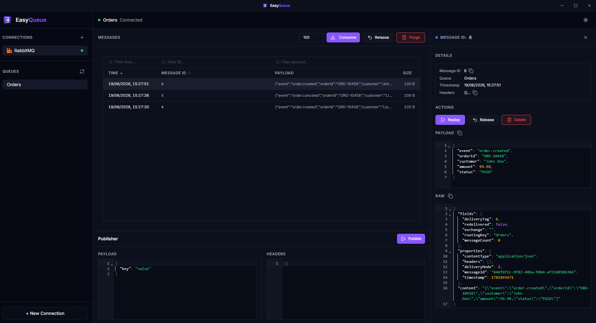
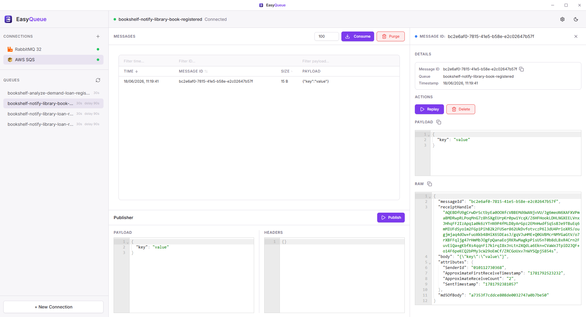

<p align="center">
  
</p>

<h1 align="center">EasyQueue</h1>

<p align="center">
  <strong>The Postman for Message Brokers</strong>
</p>

<p align="center">
  Inspect, publish, consume, and debug queue messages across AWS SQS, RabbitMQ, Azure Service Bus, Redis Streams, and NATS JetStream from a single desktop application.
</p>

<p align="center">
  
  
  
  
  
</p>

<p align="center">
  <a href="#why-easyqueue">Why EasyQueue?</a> •
  <a href="#screenshots">Screenshots</a> •
  <a href="#features">Features</a> •
  <a href="#supported-brokers">Supported Brokers</a> •
  <a href="#installation">Installation</a> •
  <a href="#development">Development</a> •
  <a href="#roadmap">Roadmap</a>
</p>

---

## Why EasyQueue?

Working with message brokers often means jumping between multiple tools:

- AWS Console
- RabbitMQ Management UI
- Internal dashboards
- Logs
- Terminal commands

Just to inspect a single message.

EasyQueue provides a unified desktop experience for browsing queues, inspecting payloads, publishing messages, and debugging asynchronous systems.

No browser tabs. No cloud dependency. Just your queues.

---

## Preview

<p align="center">
  
</p>

---

## Screenshots

<p align="center">
  
  
  
</p>

---

## Highlights

- ✅ Five supported providers: RabbitMQ, AWS SQS, Azure Service Bus, Redis Streams, and NATS JetStream
- ✅ Local-first desktop application
- ✅ Connections stored locally
- ✅ Encrypted credential storage
- ✅ Publish and consume messages
- ✅ JSON payload viewer
- ✅ Dark and Light themes
- ✅ Cross-platform support

---

## Privacy First

EasyQueue stores all connections locally on your machine.

Sensitive credentials are encrypted before being persisted, and no queue data is sent to external EasyQueue servers.

Your infrastructure stays under your control.

---

## Supported Brokers

| Broker | Status |
|----------|----------|
| RabbitMQ | ✅ Supported |
| AWS SQS | ✅ Supported |
| Azure Service Bus | ✅ Supported |
| Redis Streams | ✅ Supported |
| NATS JetStream | ✅ Supported |

---

## Features

| Feature                    | Description                                                  |
| -------------------------- | ------------------------------------------------------------ |
| Multi-provider connections | Connect to different message brokers from a single interface |
| Queue browsing             | Explore queues and message counts                            |
| Message inspection         | View full payloads with formatted JSON                       |
| Publish messages           | Send messages directly to queues                             |
| Consume messages           | Consume messages directly from the queue                     |
| Release messages           | Return consumed messages back to the queue                   |
| Replay messages            | Re-publish individual messages                               |
| Delete messages            | Remove individual messages                                   |
| Purge queues               | Remove all pending messages from a queue                     |
| Search and filter          | Find messages quickly                                        |
| JSON viewer                | Formatted JSON payload viewer in text mode                   |
| Dark / Light theme         | Switch themes instantly                                      |
| Cross-platform             | Windows, macOS, and Linux                                    |


---

## Installation

### Download

Download the latest release:

https://github.com/sousadiego11/easyqueue/releases

| Platform | Package |
|-----------|----------|
| Windows | `.exe` / `.msi` |
| macOS Intel | `.dmg` |
| macOS Apple Silicon | `.dmg` |
| Linux | `.AppImage` / `.deb` |

---

### Build From Source

Requirements:

- Node.js >= 20
- pnpm

```bash
git clone https://github.com/sousadiego11/easyqueue.git

cd easyqueue

pnpm install

pnpm build
```

> **Note:** `pnpm build` produces the app bundles in `dist/`. Installers (`.exe`, `.dmg`, `.AppImage`) are built in CI via `electron-builder`. To produce a local installer, run `npx electron-builder --win` (or `--mac`, `--linux`) after building.

---

## Development

### Project Structure

```text
apps/
  desktop/

packages/
  core/
  provider-sqs/
  provider-rabbitmq/
  provider-azureservicebus/
  provider-redisstreams/
  provider-natsjetstream/
  shared/
```

### Commands

```bash
# Install dependencies
pnpm install

# Start Electron + React
pnpm dev

# Type-check
pnpm typecheck

# Unit tests
pnpm test

# End-to-end tests
pnpm test:e2e

# Production build
pnpm build

# Clean artifacts
pnpm clean
```

---

## Architecture

```text
core
  ↑
providers
  ↑
desktop
```

### Core

Contains shared contracts and abstractions.

Examples:

* QueueClient
* QueueMessage
* Connection

### Providers

Each broker implements the same interface.

Current providers:

* RabbitMQ
* AWS SQS
* Azure Service Bus
* Redis Streams
* NATS JetStream

### Desktop

Electron + React application built on top of provider abstractions.

The UI never interacts directly with broker-specific implementations.

---

## Roadmap

### Completed

* [x] RabbitMQ provider
* [x] AWS SQS provider
* [x] Azure Service Bus provider
* [x] Redis Streams provider
* [x] NATS JetStream provider
* [x] Queue browsing
* [x] Publish messages
* [x] Consume messages
* [x] Delete messages
* [x] Release messages
* [x] Replay messages
* [x] Purge queues
* [x] Message normalization
* [x] JSON payload viewer
* [x] Search and filtering
* [x] Dark / Light themes
* [x] Local encrypted connection storage

### Future

* [ ] Message re-drive (re-publish to a different queue)
* [ ] Message diff
* [ ] Plugin system for third-party providers

---

## Contributing

Contributions are welcome.

1. Fork the repository
2. Create a branch

```bash
git checkout -b feature/my-feature
```

3. Commit your changes

```bash
git commit -m "Add my feature"
```

4. Push the branch

```bash
git push origin feature/my-feature
```

5. Open a Pull Request

See `AGENTS.md` for coding guidelines and architectural decisions.

---

## License

Distributed under the MIT License.

See the LICENSE file for details.

---

<p align="center">
  <strong>Stop switching tabs. Start debugging messages.</strong>
</p>
