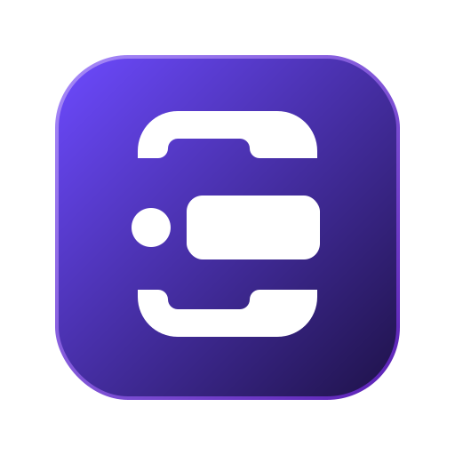

<p align="center">
  
</p>

<h1 align="center">EasyQueue</h1>

<p align="center">
  <strong>Postman for Message Brokers</strong>
</p>

<p align="center">
  A unified desktop application to inspect, publish, and debug queue messages
  across multiple message brokers — without ever leaving your machine.
</p>

<p align="center">
  <a href="#features">Features</a> •
  <a href="#screenshots">Screenshots</a> •
  <a href="#installation">Installation</a> •
  <a href="#development">Development</a> •
  <a href="#roadmap">Roadmap</a> •
  <a href="#contributing">Contributing</a>
</p>

<p align="center">
  
  
  
  
  
</p>

---

## About

Every team that works with message queues eventually faces the same frustration: switching between AWS Console, RabbitMQ Management UI, Kafka CLI tools, and half a dozen browser tabs just to read a single message.

EasyQueue solves this by providing a single, native desktop interface that works across providers. Connect once, and you can browse queues, inspect messages, publish payloads, and debug your async workflows — all from one place.

It is built for developers who value speed, clarity, and local tooling. No cloud dependency. No browser tabs. Just your queues, at your fingertips.

## Features

| Feature | Description |
|---|---|
| **Multi-provider connections** | Connect to SQS, RabbitMQ, and Kafka from a single interface |
| **Queue browsing** | List all queues from a connected broker with message counts |
| **Message inspection** | Navigate through messages with full JSON payload viewing |
| **Publish messages** | Compose and send messages directly to any queue |
| **Consume messages** | Poll and consume messages using native broker mechanisms |
| **Delete messages** | Remove individual messages or purge entire queues |
| **Re-drive messages** | Re-queue messages to a different target |
| **Formatted JSON viewer** | Syntax-highlighted, collapsible tree view for message payloads |
| **Search & filter** | Find messages by content, headers, or attributes |
| **Dark / Light theme** | Toggle between themes with instant switch |
| **Cross-platform** | Runs natively on Windows, macOS, and Linux |

## Screenshots

> Screenshots will be added as the project matures.

### Connections


### Queue Explorer


### Message Detail


### Publisher


## Installation

### Pre-built binaries

Download the latest release for your platform from the [Releases](https://github.com/user/easyqueue/releases) page.

| Platform | Format |
|---|---|
| Windows | `.exe` / `.msi` |
| macOS (Intel) | `.dmg` |
| macOS (Apple Silicon) | `.dmg` |
| Linux | `.AppImage` / `.deb` |

### From source

Requires Node.js >= 20 and pnpm.

```bash
git clone https://github.com/user/easyqueue.git
cd easyqueue
pnpm install
pnpm build
```

## Development

EasyQueue uses a pnpm monorepo with the following structure:

```
apps/
  desktop/          # Electron + React + Vite application
packages/
  core/             # Common contracts and interfaces
  provider-sqs/     # AWS SQS provider
  provider-rabbitmq/ # RabbitMQ provider
  shared/           # Shared utilities
```

### Commands

```bash
# Install dependencies
pnpm install

# Start development server (renderer + Electron)
pnpm dev

# Type-check the entire project
pnpm typecheck

# Run unit tests
pnpm test

# Run end-to-end tests
pnpm test:e2e

# Build for production
pnpm build

# Clean build artifacts
pnpm clean
```

## Roadmap

### Active development

- [x] SQS provider (connect, list, publish, consume)
- [x] RabbitMQ provider (connect, list, publish, consume)
- [x] Message normalization via `QueueMessage` interface
- [x] Dark / Light theme
- [x] JSON payload viewer
- [x] Message search and filter
- [ ] Kafka provider
- [ ] Message re-drive (re-publish to a different queue)
- [ ] Saved connections (persist connection config)

### Future

- [ ] Azure Service Bus provider
- [ ] Redis Streams provider
- [ ] Google Pub/Sub provider
- [ ] Message diff (compare two messages side by side)
- [ ] Message replay (re-publish historical messages)
- [ ] Team workspaces (share connections and configurations)
- [ ] Plugin system for third-party providers

## Architecture

```
core           ←  Common contracts (QueueClient, QueueMessage, Connection)
  ↑
providers      ←  Provider implementations (SQS, RabbitMQ, Kafka)
  ↑
desktop        ←  Electron application (React, Tailwind, shadcnUI)
```

- `core` never depends on providers.
- Providers implement `QueueClient` and normalize broker-specific objects into `QueueMessage`.
- The desktop application has zero knowledge of provider internals. All interaction goes through `QueueClient`.
- Listening uses native broker mechanisms (SQS long polling, RabbitMQ channel consumers) — no cron jobs.

## Contributing

Contributions are welcome. Please open an issue first to discuss what you would like to change.

1. Fork the repository
2. Create a feature branch (`git checkout -b feature/my-feature`)
3. Commit your changes (`git commit -am 'Add my feature'`)
4. Push to the branch (`git push origin feature/my-feature`)
5. Open a Pull Request

See [AGENTS.md](./AGENTS.md) for the full coding guidelines and architecture philosophy.

## License

Distributed under the MIT License. See [LICENSE](./LICENSE) for more information.

---

<p align="center">
  <strong>EasyQueue</strong> — Observability for asynchronous systems, productivity for developers.
</p>
